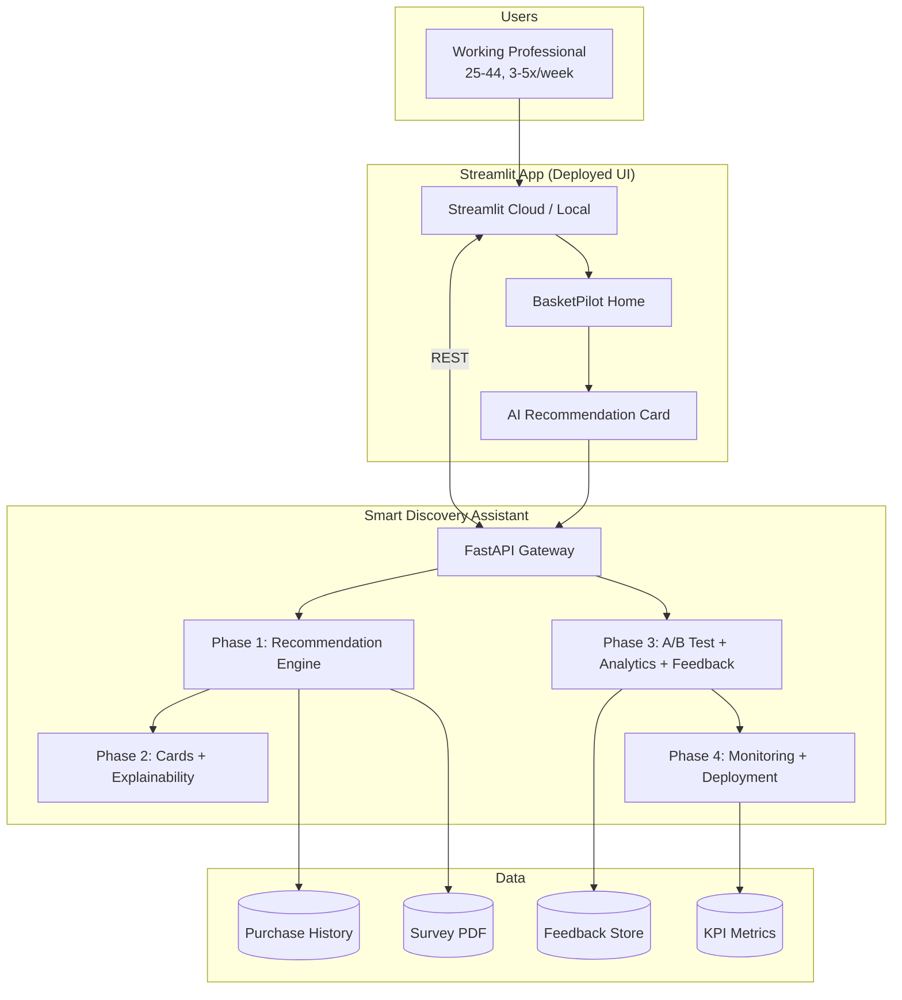
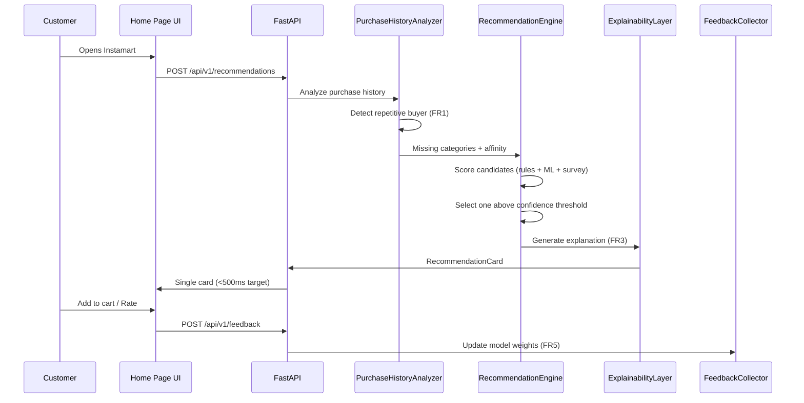
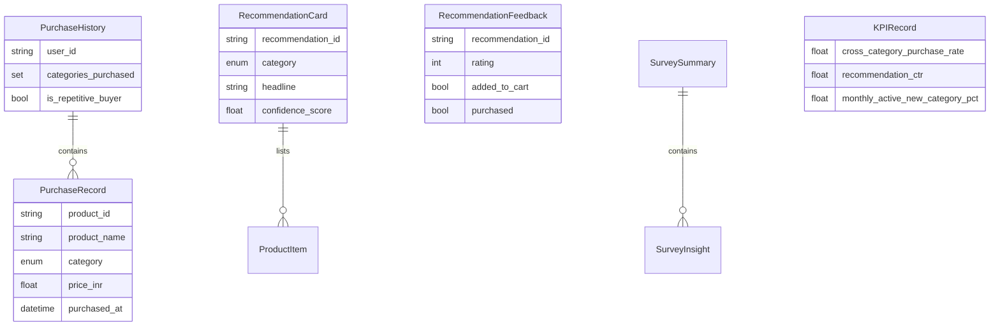
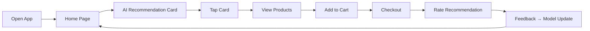
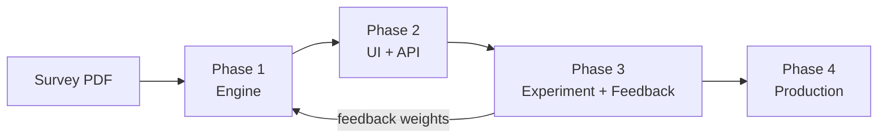
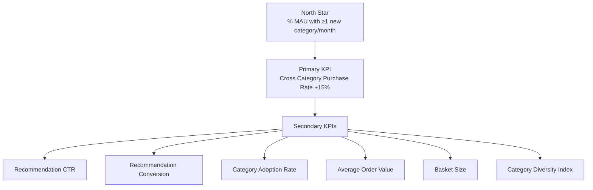
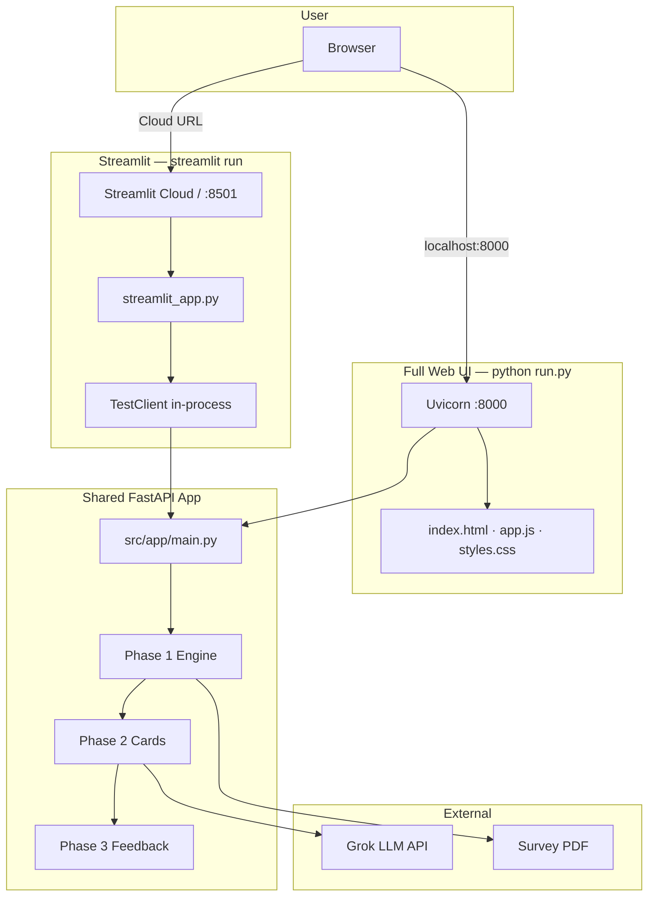
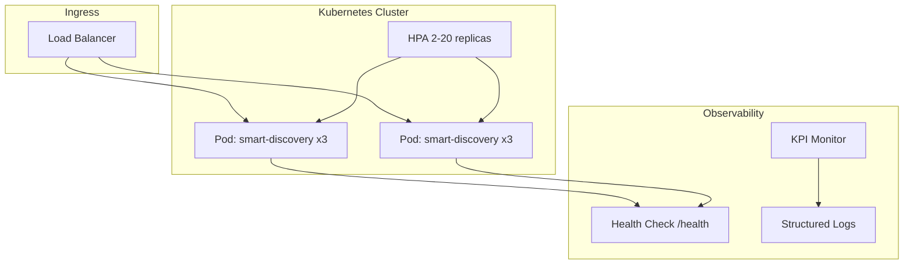

# Architecture Document
## Smart Discovery Assistant — AI-powered Cross Category Discovery for Swiggy Instamart

| Field | Value |
|-------|-------|
| **Version** | 1.0 |
| **Source PRD** | `problemStatement.md` |
| **Product** | Smart Discovery Assistant (AI Shopping Companion) |
| **Status** | MVP — Phase 1–4 implemented; **Streamlit Cloud** + full **Web UI** via FastAPI |

---

## Table of Contents

1. [Executive Summary](#1-executive-summary)
2. [Problem & Business Context](#2-problem--business-context)
3. [Target Users & Research Inputs](#3-target-users--research-inputs)
4. [Product Vision & MVP Scope](#4-product-vision--mvp-scope)
5. [System Architecture](#5-system-architecture)
6. [AI Workflow & Decision Pipeline](#6-ai-workflow--decision-pipeline)
7. [Component Architecture](#7-component-architecture)
8. [Data Architecture](#8-data-architecture)
9. [API Architecture](#9-api-architecture)
10. [User Flow Architecture](#10-user-flow-architecture)
11. [Phase-wise Implementation Roadmap](#11-phase-wise-implementation-roadmap)
12. [Functional Requirements Traceability](#12-functional-requirements-traceability)
13. [Non-Functional Requirements](#13-non-functional-requirements)
14. [Success Metrics & Observability](#14-success-metrics--observability)
15. [Risk Architecture & Mitigations](#15-risk-architecture--mitigations)
16. [Deployment Architecture](#16-deployment-architecture)
17. [Future Enhancements](#17-future-enhancements)
18. [Technology Stack](#18-technology-stack)
19. [Repository Structure](#19-repository-structure)

---

## 1. Executive Summary

Swiggy Instamart users are **goal-oriented repeat shoppers** who rarely explore beyond their habitual categories (Milk, Bread, Fruits). This limits cross-category penetration, AOV, and LTV.

**Smart Discovery Assistant** is an AI-native MVP that acts as a shopping companion: it reads purchase history, identifies missing categories, predicts the single most relevant new category, explains why, and surfaces it as one recommendation card per session.

The architecture is delivered in **four phases** over eight weeks (Phase 4 ongoing), with a modular Python backend (FastAPI), ML scoring layer, survey-informed priors, and a lightweight web UI for recommendation cards.

**North Star Metric:** % of Monthly Active Customers purchasing at least one new category every month — target **+15%** lift in Cross Category Purchase Rate.

---

## 2. Problem & Business Context

### 2.1 Problem Statement

| Symptom | Business Impact |
|---------|-----------------|
| Low cross-category penetration | Stagnant basket diversity |
| Users repeat same categories weekly | Lower AOV |
| Generic recommendation widgets ignored | Limited product discovery |
| Instamart treated as task-completion, not discovery | Lower LTV |

### 2.2 Root Cause

```
Users visit with a predefined shopping list
        +
Current recommendations are generic, not contextual
        =
No discovery behaviour
```

### 2.3 Business Objective

| State | User Behaviour |
|-------|----------------|
| **Current** | Purchases Milk, Bread, Fruits only |
| **Target** | Additionally purchases Pet Supplies, Health & Wellness, Personal Care |

### 2.4 Value Proposition

| Stakeholder | Value |
|-------------|-------|
| **User** | Save browsing time, discover relevant products, better offers, fewer shopping sessions |
| **Business** | Higher AOV, basket size, repeat purchase, cross-category penetration, LTV |

---

## 3. Target Users & Research Inputs

### 3.1 Primary Segment

| Attribute | Profile |
|-----------|---------|
| Segment | Working Professionals |
| Age | 25–44 years |
| Frequency | 3–5 shops/week |
| Behaviour | Goal-oriented, search directly, reorder previous purchases, urgent buys |

### 3.2 Survey Research (n = 10)

Survey responses are ingested from a PDF configured via environment variable:

```env
SURVEY_PDF_PATH=data/survey/responses.pdf
```

**Parser:** `src/shared/survey/pdf_parser.py` → `load_survey_summary()`

| Finding | Implication for Architecture |
|---------|-------------------------------|
| Shopping is highly intentional | Do not rely on browse-based discovery; inject one card at home |
| Top barriers: irrelevant recs, no time | One card, high confidence, explainable reason |
| Willing if personalized, trusted, bundled | Explainability layer + trust signals + bundle suggestions |
| Price comparison vs Blinkit, Zepto, etc. | Price comparison field on recommendation card |
| Top explore categories: Health, Pet, Household, Personal Care | `EXPLORATION_PRIORITY` list in recommendation engine |

When PDF is unavailable, PRD-validated defaults are used (10 respondents, 85% willingness score).

---

## 4. Product Vision & MVP Scope

### 4.1 Vision

> An **AI Shopping Companion** that understands shopping history, purchase frequency, seasonality, urgency, and household profile — and recommends **one highly relevant new category every order**.

### 4.2 MVP Features

| # | Feature | Input | Output | Module |
|---|---------|-------|--------|--------|
| F1 | Personalized Category Recommendation | Purchase history | One new category | `CategoryRecommendationEngine` |
| F2 | AI Explainability | History + category | Natural-language reason | `ExplainabilityLayer` |
| F3 | Bundle Suggestions | Primary category | Complementary items | `ExplainabilityLayer.bundle_suggestion()` |
| F4 | Smart Rewards | First cross-category buy | Coins, cashback, bonus | `RecommendationCard.rewards` |

### 4.3 Recommendation Card Schema

Each card exposes:

- **Reason** — "Because you frequently buy…"
- **Trust signal** — ★★★★★ brand/rating cue
- **Price comparison** — vs Blinkit/competitors
- **Bundle discount** — complementary items
- **One-click Add** — single CTA

Built by `RecommendationCardBuilder` → `src/phase2/cards/builder.py`

---

## 5. System Architecture

### 5.1 High-Level Context Diagram



### 5.2 Layered Architecture

```
┌──────────────────────────────────────────────────────────────┐
│  Presentation Layer (Streamlit deployment)                   │
│  streamlit_app.py · phase2/frontend/ (BasketPilot demo UI)   │
├──────────────────────────────────────────────────────────────┤
│  API Layer (Phase 2)                                         │
│  src/phase2/api/main.py — REST endpoints, latency tracking   │
├──────────────────────────────────────────────────────────────┤
│  Application Layer                                           │
│  Cards · Explainability · A/B Test · Feedback · Analytics    │
├──────────────────────────────────────────────────────────────┤
│  Domain / AI Layer (Phase 1)                                 │
│  PurchaseHistoryAnalyzer · CategoryRecommendationEngine      │
│  CategoryModelTrainer (GradientBoostingClassifier)           │
├──────────────────────────────────────────────────────────────┤
│  Shared Domain & Config                                      │
│  domain models · survey PDF parser · settings (.env)         │
├──────────────────────────────────────────────────────────────┤
│  Infrastructure (Phase 4)                                    │
│  Deployment spec · KPI Monitor · Continuous learning hooks   │
└──────────────────────────────────────────────────────────────┘
```

---

## 6. AI Workflow & Decision Pipeline

Aligned with PRD Section 8.



### 6.1 Scoring Model

The engine combines three signal sources:

| Signal | Weight Role | Source |
|--------|-------------|--------|
| **Rule-based affinity** | Category co-occurrence from purchase history | `CATEGORY_AFFINITY` map |
| **Survey priors** | Boost categories users want to explore | `load_survey_summary()` |
| **ML classifier** | Feature-vector scoring | `CategoryModelTrainer` (GradientBoosting) |
| **Feedback loop** | Per-user/category weight adjustments | `update_from_feedback()` |

**Confidence gate:** Recommendations below `RECOMMENDATION_CONFIDENCE_THRESHOLD` (default `0.65`) are suppressed.

**Session cap:** Maximum `1` recommendation per session (`MAX_RECOMMENDATIONS_PER_SESSION`).

### 6.2 Feature Vector (ML Input)

| Feature | Description |
|---------|-------------|
| `affinity_hits` | Related categories already purchased |
| `survey_hit` | Category in top survey exploration list |
| `diversity` | Ratio of unique categories to total catalog |
| `repetitive` | Binary flag for repetitive buyer |
| `bias` | Intercept term |

---

## 7. Component Architecture

### 7.1 Phase 1 — Recommendation Engine (Weeks 1–2)

| Component | Path | Responsibility |
|-----------|------|----------------|
| Purchase History Analyzer | `src/phase1/purchase_history/analyzer.py` | Frequent categories, missing categories, affinity, replenishment patterns |
| Recommendation Engine | `src/phase1/recommendation_engine/engine.py` | Score candidates, return exactly one category |
| Model Trainer | `src/phase1/models/trainer.py` | Train/persist GradientBoosting classifier |

**Key classes:**

- `PurchaseHistoryAnalyzer` — pattern detection on `PurchaseHistory`
- `CategoryRecommendationEngine.recommend_one()` — FR2 enforcement
- `CategoryModelTrainer` — offline training via `POST /api/v1/model/train`

### 7.2 Phase 2 — UI Integration (Weeks 3–4)

| Component | Path | Responsibility |
|-----------|------|----------------|
| Discovery UI Service | `src/phase2/service.py` | Orchestrates Phase 1 pipeline → card for UI |
| Phase 2 API Router | `src/phase2/api/router.py` | Card endpoints, frontend mount |
| Recommendation Card Builder | `src/phase2/cards/builder.py` | Assemble card with products, bundles, rewards |
| Product Catalog | `src/phase2/cards/catalog.py` | Category → product mapping, price comparison |
| Explainability Layer | `src/phase2/explainability/layer.py` | Headline, reason, trust signal, context (FR3) |
| Grok LLM Client | `src/phase2/explainability/grok_client.py` | Optional Grok-powered copy generation |
| Frontend | `src/phase2/frontend/` | Instamart-style recommendation card UI |
| App Entry | `src/app/main.py` | FastAPI bootstrap, router aggregation |

**Grok LLM integration (optional):**

When `USE_LLM=true` and an API key is set in `.env`, the explainability layer calls **Grok LLM** (xAI) to generate personalized headline, reason, and context. If the LLM call fails or is disabled, rule-based templates are used automatically — the pipeline never blocks on LLM availability.

| `.env` Variable | Purpose |
|-----------------|---------|
| `GROK_API_KEY` | Primary Grok (xAI) API key |
| `GROQ_API_KEY` | Optional fallback key (Groq-compatible endpoint) |
| `GROK_MODEL` | Grok model name (default: `grok-2-latest`) |
| `GROQ_MODEL` | Fallback model when using Groq key |
| `USE_LLM` | Enable/disable LLM explainability (`true` / `false`) |

Cards include `explainability_source`: `"grok"` or `"rules"`.

### 7.3 Phase 3 — Experimentation & Learning (Weeks 5–6)

| Component | Path | Responsibility |
|-----------|------|----------------|
| Experiment Service | `src/phase3/service.py` | Orchestrates A/B, analytics, feedback |
| Phase 3 API Router | `src/phase3/api/router.py` | Dashboard, feedback, experiment endpoints |
| A/B Test Manager | `src/phase3/ab_testing/experiment.py` | 50/50 control vs treatment split |
| Analytics Dashboard | `src/phase3/analytics/dashboard.py` | KPI aggregation, impression/feedback tracking |
| Feedback Collector | `src/phase3/feedback/collector.py` | Capture ratings, cart adds, purchases → retrain weights |

**A/B design:**

| Variant | Experience |
|---------|------------|
| **Control** | Generic "People also bought" widget (no AI card) |
| **Treatment** | Smart Discovery Assistant single recommendation card |

Assignment: deterministic hash of `user_id` → bucket. Tracks impressions, CTR, cart adds, and conversions per variant.

### 7.4 Phase 4 — Production (Ongoing)

| Component | Path | Responsibility |
|-----------|------|----------------|
| Streamlit App | `streamlit_app.py` | **Cloud deployment** — in-process TestClient, 4-tab Streamlit UI |
| Web Frontend | `src/phase2/frontend/` | **Full demo UI** — bottom nav, search, checkout (served by `run.py`) |
| Streamlit Config | `.streamlit/config.toml` | Theme, layout, cloud deployment settings |
| Production Service | `src/phase4/service.py` | Deployment, monitoring, learning orchestration |
| Phase 4 API Router | `src/phase4/api/router.py` | K8s manifests, alerts, retrain triggers |
| Deployment Config | `src/phase4/deployment/config.py` | K8s replicas, autoscaling, SLA spec (optional scale-out) |
| Kubernetes Generator | `src/phase4/deployment/kubernetes.py` | Deployment, Service, HPA manifests (optional) |
| KPI Monitor | `src/phase4/monitoring/kpi_monitor.py` | Threshold alerts, North Star tracking, SLA checks |
| Continuous Learner | `src/phase4/learning/retrainer.py` | Batch retrain from feedback when enabled |
| Dockerfile | `Dockerfile` | Production container image |

---

## 8. Data Architecture

### 8.1 Domain Models

Defined in `src/shared/models/domain.py`:



### 8.2 Category Catalog

| Enum Value | PRD Alignment |
|------------|---------------|
| `Milk & Dairy` | Current habitual purchase |
| `Bread & Bakery` | Current habitual purchase |
| `Fruits & Vegetables` | Current habitual purchase |
| `Health & Wellness` | Top survey exploration category |
| `Pet Supplies` | Top survey exploration category |
| `Household Essentials` | Top survey exploration category |
| `Beauty & Personal Care` | Top survey exploration category |
| `Snacks & Beverages` | Bundle/complement category |
| `Baby Care` | Affinity-driven |
| `Frozen Foods` | Affinity-driven |

### 8.3 Configuration (Environment)

Managed by `config/settings.py`:

| Variable | Default | Purpose |
|----------|---------|---------|
| `SURVEY_PDF_PATH` | `data/survey/responses.pdf` | Survey research PDF |
| `RECOMMENDATION_CONFIDENCE_THRESHOLD` | `0.65` | Suppress low-confidence recs |
| `MAX_RECOMMENDATIONS_PER_SESSION` | `1` | One card per session |
| `RECOMMENDATION_LATENCY_MS` | `500` | NFR latency budget |
| `AB_TEST_ENABLED` | `true` | Toggle experiment |
| `AB_TEST_CONTROL_RATIO` | `0.5` | Control group size |
| `ENABLE_CONTINUOUS_LEARNING` | `false` | Phase 4 online learning |
| `GROK_API_KEY` | — | Grok LLM API key (optional, Phase 2 explainability) |
| `GROQ_API_KEY` | — | Fallback LLM key if Grok key not set |
| `GROK_MODEL` | `grok-2-latest` | Grok model for explainability |
| `GROQ_MODEL` | `llama-3.3-70b-versatile` | Fallback model name |
| `USE_LLM` | `false` | Enable Grok LLM for card copy generation |

---

## 9. API Architecture

Base URL: `http://localhost:8000` (configurable via `APP_HOST` / `APP_PORT`)

| Method | Endpoint | Phase | Description |
|--------|----------|-------|-------------|
| `GET` | `/health` | App | Liveness probe |
| `GET` | `/` | 2 | Recommendation card UI |
| `GET` | `/api/v1/phase1/health` | 1 | Phase 1 status |
| `POST` | `/api/v1/phase1/analyze` | 1 | Purchase history analysis |
| `POST` | `/api/v1/phase1/recommend` | 1 | Raw category recommendation |
| `POST` | `/api/v1/phase1/model/train` | 1 | Train ML classifier |
| `GET` | `/api/v1/phase2/health` | 2 | Phase 2 + LLM status |
| `POST` | `/api/v1/phase2/cards` | 2 | **Full recommendation card** |
| `POST` | `/api/v1/phase2/cards/demo` | 2 | Demo card for `user_001` |
| `GET` | `/api/v1/survey/summary` | Shared | Survey insights from PDF |
| `POST` | `/api/v1/recommendations` | 2 | Legacy card endpoint + A/B split |
| `POST` | `/api/v1/phase3/feedback` | 3 | Submit feedback + update model (FR5) |
| `GET` | `/api/v1/phase3/analytics/dashboard` | 3 | Full KPI + A/B + feedback dashboard |
| `GET` | `/api/v1/phase3/ab-test/assign/{user_id}` | 3 | Get experiment variant |
| `GET` | `/api/v1/phase3/ab-test/results` | 3 | A/B lift report |
| `GET` | `/api/v1/phase4/deployment/spec` | 4 | Production SLA & replica config |
| `GET` | `/api/v1/phase4/deployment/kubernetes` | 4 | K8s Deployment/Service/HPA YAML JSON |
| `GET` | `/api/v1/phase4/monitoring/status` | 4 | KPI alerts + SLA compliance |
| `POST` | `/api/v1/phase4/learning/retrain` | 4 | Trigger continuous learning cycle |
| `POST` | `/api/v1/feedback` | 3 | Legacy feedback endpoint |
| `GET` | `/api/v1/analytics/kpis` | 3 | Success metrics dashboard |
| `GET` | `/api/v1/analytics/ab-test` | 3 | Experiment lift report |
| `POST` | `/api/v1/model/train` | 1 | Retrain ML classifier |
| `GET` | `/api/v1/phases` | App | Roadmap status |

### 9.1 Recommendation Request/Response

**Request:**
```json
{
  "user_id": "user_001",
  "purchase_records": []
}
```

Empty `purchase_records` uses sample demo history from `data/sample/purchase_history.py`.

**Response (treatment):**
```json
{
  "variant": "treatment",
  "recommendation": {
    "category": "Health & Wellness",
    "headline": "You purchase fruits regularly. Would you like Vitamin Gummies?",
    "reason": "We noticed you buy milk & dairy frequently (6 times recently).",
    "trust_signal": "★★★★★ Top-rated wellness picks",
    "products": [...],
    "bundle_items": ["Yogurt", "Granola", "Honey"],
    "rewards": [...],
    "confidence_score": 0.794
  },
  "latency_ms": 42.5
}
```

---

## 10. User Flow Architecture

PRD Section 10 mapped to system touchpoints:



| Step | UI Component | Backend |
|------|--------------|---------|
| Home Page load | `frontend/app.js` → `loadRecommendation()` | `POST /api/v1/recommendations` |
| Display card | `#card` section in `index.html` | `RecommendationCard` schema |
| One-click Add | `#add-btn` | `POST /api/v1/feedback` (rating + cart) |
| Rate stars | `#stars` | `POST /api/v1/feedback` |
| Post-purchase refresh | Re-open app | New purchase records → FR4 dynamic update |

---

## 11. Phase-wise Implementation Roadmap

| Phase | Timeline | Deliverables | Status |
|-------|----------|--------------|--------|
| **Phase 1** | Weeks 1–2 | Purchase history analysis, recommendation engine, ML trainer | ✅ Implemented |
| **Phase 2** | Weeks 3–4 | API gateway, recommendation cards, explainability, frontend | ✅ Implemented |
| **Phase 3** | Weeks 5–6 | A/B testing, analytics dashboard, feedback loop | ✅ Implemented |
| **Phase 4** | Ongoing | Streamlit deployment, continuous learning, KPI monitoring | ✅ Implemented |

### Phase Dependency Graph



---

## 12. Functional Requirements Traceability

| ID | Requirement | Architecture Decision | Implementation |
|----|-------------|----------------------|----------------|
| **FR1** | Identify repetitive buying behaviour | Gate recommendations to high-repeat users only | `PurchaseHistory.is_repetitive_buyer` — true when ≥60% of purchases fall in one category |
| **FR2** | Recommend exactly one new category | Single-output engine with confidence threshold | `CategoryRecommendationEngine.recommend_one()` |
| **FR3** | Explain why suggested | Template + history-driven explainability | `ExplainabilityLayer.generate()` |
| **FR4** | Update after every purchase | Stateless API — pass fresh records each call | Client sends updated `purchase_records` on each session |
| **FR5** | Feedback improves recommendations | Online weight adjustment per user/category | `FeedbackCollector` → `engine.update_from_feedback()` |

---

## 13. Non-Functional Requirements

| NFR | Target | Architecture Approach |
|-----|--------|----------------------|
| **Latency** | < 500 ms | In-memory scoring, no external ML serving call in MVP; latency returned in API response |
| **Availability** | 99.9% (scale-out) | MVP: Streamlit Community Cloud + hosted FastAPI; Phase 4 optional K8s: 3 replicas, `/health`, autoscaling 2–20 pods |
| **Scale** | Millions of users | Stateless API tier; horizontal scaling; user_id-hash A/B assignment |
| **Real-time personalization** | Per session | Fresh purchase history input + feedback weights applied at request time |
| **Session discipline** | Max 1 recommendation | Enforced by `MAX_RECOMMENDATIONS_PER_SESSION` and single-card UI |

---

## 14. Success Metrics & Observability

### 14.1 KPI Hierarchy



### 14.2 Instrumentation

| Metric | Collector | Endpoint |
|--------|-----------|----------|
| Impressions | `AnalyticsDashboard.track_impression()` | Triggered on recommendation response |
| Feedback / ratings | `AnalyticsDashboard.track_feedback()` | `POST /api/v1/feedback` |
| A/B conversion | `ABTestManager.record_conversion()` | Experiment analysis |
| KPI rollup | `AnalyticsDashboard.get_kpi_summary()` | `GET /api/v1/analytics/kpis` |
| Alerting | `KPIMonitor.check_thresholds()` | Phase 4 production monitor |

---

## 15. Risk Architecture & Mitigations

| Risk | Impact | Mitigation | Architecture Control |
|------|--------|------------|---------------------|
| Low recommendation accuracy | Users ignore card | Feedback loop retrains weights | `FeedbackCollector` + `update_from_feedback()` |
| Too many recommendations | Recommendation fatigue | Max 1 per session | `MAX_RECOMMENDATIONS_PER_SESSION = 1` |
| Wrong category prediction | Trust erosion | Confidence threshold suppresses weak recs | `RECOMMENDATION_CONFIDENCE_THRESHOLD = 0.65` |
| Irrelevant to time-poor users | Low CTR | Single high-quality card with explainability | Explainability + survey priors |
| Price sensitivity | Cart abandonment | Competitor price comparison on card | `price_comparison_note` on `RecommendationCard` |

---

## 16. Deployment Architecture

BasketPilot supports **two deployment surfaces**:

1. **Full Web UI** — FastAPI serves `src/phase2/frontend/` at `python run.py` → `:8000` (local / hosted API).
2. **Streamlit** — `streamlit run streamlit_app.py` → `:8501` for assignment hosting on **Streamlit Community Cloud**.

Both surfaces call the same Phase 1–4 engine. Streamlit uses an **in-process TestClient** so Cloud deploys do not depend on browser → `localhost` API calls (which cause connection failures).

**Operational guide:** [docs/deployment.md](deployment.md)

### 16.1 Deployment Overview

| Aspect | Choice | Rationale |
|--------|--------|-----------|
| **Assignment / Cloud platform** | Streamlit Community Cloud | One-click GitHub deploy, secrets management, no separate API host for MVP |
| **Backend** | FastAPI + Uvicorn (`run.py`) | REST API for full web UI and future Instamart integration |
| **Full demo UI** | `src/phase2/frontend/` | Bottom tab bar (Home · Discover · Checkout · Insights), compact usual-picks frame, search, checkout flow |
| **Streamlit UI** | `streamlit_app.py` | Native pages mirroring the four tabs; TestClient calls FastAPI in-process |
| **Secrets** | `.env` locally · Streamlit Secrets in cloud | `GROK_API_KEY`, `SURVEY_PDF_PATH`, `USE_LLM` |

### 16.2 Deployment Topology



**Web UI request flow (`run.py`):**

1. User opens http://localhost:8000.
2. Static frontend loads; `app.js` calls `/api/v1/phase2/cards`, `/api/v1/phase3/feedback`, etc. on the same origin.
3. Bottom navigation switches Home / Discover / Checkout / Insights without full page reload.

**Streamlit request flow (`streamlit_app.py`):**

1. User opens Streamlit URL (local `:8501` or Community Cloud).
2. `get_api_client()` caches a Starlette `TestClient` around `src.app.main:app`.
3. Page actions call `POST /api/v1/phase2/cards` and `POST /api/v1/phase3/feedback` in-process — no HTTP to localhost from the browser.

### 16.3 Local Development

**Option A — Full Web UI (recommended for UX demo):**

```bash
python run.py
# → http://localhost:8000
```

**Option B — Streamlit (matches Cloud deploy):**

```bash
streamlit run streamlit_app.py
# → http://localhost:8501
```

**Option C — Both** (independent; Streamlit does not require `run.py` running):

```bash
# Terminal 1
python run.py

# Terminal 2
streamlit run streamlit_app.py
```

| Variable | Default | Purpose |
|----------|---------|---------|
| `GROK_API_KEY` | — | Optional LLM explainability |
| `SURVEY_PDF_PATH` | `data/survey/responses.pdf` | Survey PDF for category priors |
| `USE_LLM` | `false` | Enable/disable Grok calls |

`streamlit>=1.32.0` is included in `requirements.txt`.

### 16.4 Streamlit Community Cloud Deployment

| Step | Action |
|------|--------|
| 1 | Push repository to GitHub |
| 2 | Connect repo at [share.streamlit.io](https://share.streamlit.io) |
| 3 | Set **Main file path** to `streamlit_app.py` |
| 4 | Add secrets (see `.streamlit/secrets.toml.example`): `GROK_API_KEY`, `SURVEY_PDF_PATH`, `USE_LLM` |
| 5 | Deploy — engine runs in-process; **no `API_BASE_URL` or separate FastAPI host required** for MVP |

**Do not** embed `http://127.0.0.1:8000` in an iframe on Streamlit Cloud — the user's browser cannot reach the server localhost (connection failure).

**Optional split deployment** (full web UI on public host):

| Service | Host | Port |
|---------|------|------|
| FastAPI + Web UI | Render / Railway / Fly.io / EC2 | 8000 |
| Streamlit | Streamlit Community Cloud | 8501 |

### 16.5 App Structure

```
streamlit_app.py                    # Streamlit entry — TestClient, session state, 4 tabs
.streamlit/
├── config.toml                     # Theme, layout, server settings
└── secrets.toml.example            # Template for Cloud / local secrets
src/phase2/frontend/
├── index.html                      # Web shell — bottom nav, compact picks frame
├── app.js                          # Cart, search, API fetch, screen routing
└── styles.css                      # Web layout + embed mode
run.py                              # Uvicorn entry — full web UI at :8000
```

| Surface | Tab / screen | Backend endpoints |
|---------|--------------|-------------------|
| Home | Usual picks frame + AI hero | `POST /api/v1/phase2/cards` |
| Discover | Full recommendation card | `POST /api/v1/phase2/cards` |
| Checkout | Cart + place order | `POST /api/v1/phase3/feedback` |
| Insights | Pilot KPIs | Session state + analytics APIs |

### 16.6 Alternative Production Topology (Kubernetes)

For scale-out beyond the Streamlit MVP, Phase 4 includes a **Kubernetes** scaffold (`src/phase4/deployment/kubernetes.py`, `Dockerfile`). This path is optional and not used for the assignment Streamlit deployment.



**SLA specification** (from `src/phase4/deployment/config.py`):

| Parameter | Value |
|-----------|-------|
| Replicas | 3 (min 2, max 20) |
| CPU | 500m per pod |
| Memory | 512Mi per pod |
| Availability | 99.9% |
| Health check | `GET /health` every 30s |
| Latency SLA | < 500 ms p95 |

### 16.7 Continuous Learning (Phase 4)

When `ENABLE_CONTINUOUS_LEARNING=true`:

1. Feedback events accumulate via `FeedbackCollector`
2. Periodic batch retrain via `CategoryModelTrainer.train()`
3. KPI Monitor validates conversion lift before weight promotion

---

## 17. Future Enhancements

PRD Section 15 — not in MVP scope; extension points identified:

| Enhancement | Extension Point |
|-------------|-----------------|
| Voice Shopping AI | New client channel → same `/api/v1/recommendations` |
| WhatsApp Shopping Assistant | Messaging webhook → API layer |
| Recipe-based recommendations | New signal in `PurchaseHistoryAnalyzer` |
| Smart Pantry prediction | Replenishment logic in analyzer (partial stub exists) |
| AI Shopping Agent | Orchestration layer above recommendation engine |
| Family shopping profiles | Extend `PurchaseHistory` with household_id |
| Predictive replenishment | `detect_replenishment_due()` in analyzer |

---

## 18. Technology Stack

| Layer | Technology | Rationale |
|-------|------------|-----------|
| API | FastAPI + Uvicorn | Async, OpenAPI docs, <500ms latency |
| Validation | Pydantic v2 | Type-safe domain models |
| ML | scikit-learn GradientBoosting | Lightweight, no GPU dependency for MVP |
| LLM | Grok (xAI) via `grok_client.py` | Optional explainability; API key in `.env` |
| Config | pydantic-settings + `.env` | Survey PDF, thresholds, Grok API key |
| Survey ingestion | PyPDF2 | PDF text extraction |
| Frontend (dev) | HTML/CSS/JS | BasketPilot demo in `phase2/frontend/` |
| **Deployment UI** | **Streamlit** | **Primary deployment platform — Community Cloud or local** |
| Container | Docker (optional) | Single-image or split FastAPI + Streamlit |
| Runtime | Python 3.10+ | Data/ML ecosystem |

---

## 19. Repository Structure

```
SwiggyInstamart_Cross_Category_Discovery/
├── config/
│   └── settings.py                 # Environment configuration (incl. Grok LLM)
├── data/
│   ├── sample/purchase_history.py  # Demo purchase data
│   ├── models/                     # Trained ML artifacts (joblib)
│   └── survey/                     # Survey PDF (SURVEY_PDF_PATH)
├── docs/
│   └── architecture.md             # This document
├── scripts/
│   └── run_phase1.py               # Phase 1 CLI
├── src/
│   ├── app/
│   │   ├── main.py                 # FastAPI entry — aggregates phase routers
│   │   └── dependencies.py         # Shared singletons
│   ├── shared/
│   │   ├── models/domain.py        # Core domain entities
│   │   └── survey/pdf_parser.py    # Survey PDF ingestion
│   ├── phase1/                     # Recommendation engine
│   │   ├── api/router.py
│   │   ├── purchase_history/analyzer.py
│   │   ├── recommendation_engine/engine.py
│   │   ├── models/trainer.py
│   │   ├── features.py
│   │   ├── pipeline.py
│   │   └── schemas.py
│   ├── phase2/                     # UI integration
│   │   ├── api/router.py
│   │   ├── service.py
│   │   ├── schemas.py
│   │   ├── cards/builder.py
│   │   ├── cards/catalog.py
│   │   ├── explainability/layer.py
│   │   ├── explainability/grok_client.py
│   │   └── frontend/
│   ├── phase3/                     # Experimentation
│   │   ├── api/router.py
│   │   ├── service.py
│   │   ├── schemas.py
│   │   ├── ab_testing/experiment.py
│   │   ├── analytics/dashboard.py
│   │   └── feedback/collector.py
│   └── phase4/                     # Production
│       ├── api/router.py
│       ├── service.py
│       ├── schemas.py
│       ├── deployment/config.py
│       ├── deployment/kubernetes.py
│       ├── monitoring/kpi_monitor.py
│       └── learning/retrainer.py
├── tests/
│   ├── test_phase1.py
│   ├── test_phase2.py
│   ├── test_phase3.py
│   └── test_phase4.py
├── streamlit_app.py                # Streamlit entry — deployed UI
├── .streamlit/
│   ├── config.toml                 # Theme & layout
│   └── secrets.toml                # Local secrets (gitignored)
├── Dockerfile                      # Optional production container (FastAPI)
├── problemStatement.md             # Source PRD
├── requirements.txt                # incl. streamlit for deployment
├── run.py                          # uvicorn → src.app.main:app
└── README.md
```

---

## Appendix A — Assignment Alignment

| Assignment Requirement | Architecture Section |
|------------------------|---------------------|
| AI-powered opportunity discovery | §5, §6, §7.1 |
| Primary research validation (10 survey responses) | §3.2, §8.3 |
| Target user segment | §3.1 |
| Root cause analysis | §2.2 |
| Existing workarounds | §2.1 (implicit in design constraints) |
| User value | §2.4 |
| Business value | §2.4, §14 |
| AI-native MVP | §4, §6 |
| Functional requirements | §12 |
| User flow | §10 |
| Success metrics | §14 |
| Production implementation roadmap | §11, §16 |
| Streamlit deployment | §16, [deployment.md](deployment.md) |

---

*Document generated from `problemStatement.md` and aligned with the implemented codebase.*
